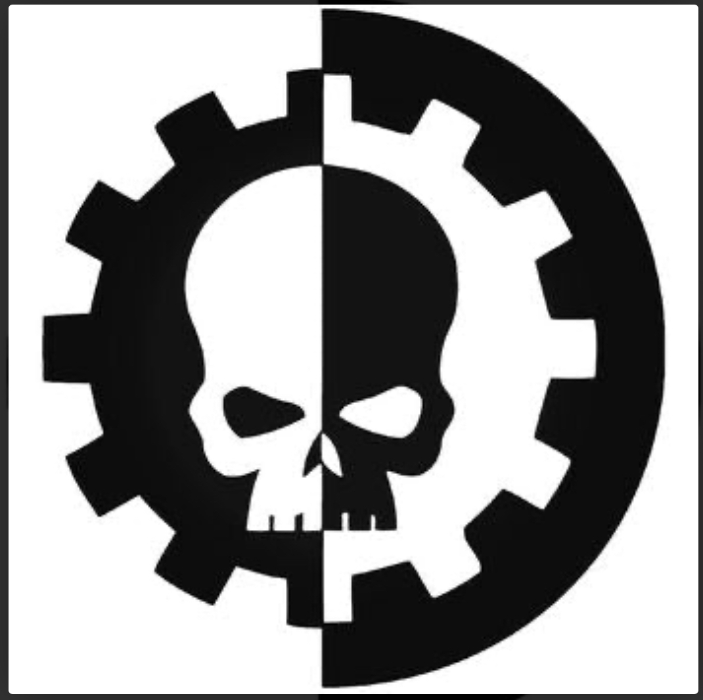

> 

**Security Notice:**  
> This documentation references internal-only, non-routable IP addresses and placeholder configurations. No live infrastructure or internet-facing systems are exposed through this repository.

# 🔱 STC-SOCaaS_v1

> **Standard Template Construct (STC): SOC-as-a-Service Platform Prototype (SOCaas)**  
> *Designed for small organizations in need of real cybersecurity. Deployed by Archmagos Prime McGahan.*

---

## 📜 Mission

This project establishes a modular, secure, and scalable Security Operations Center as a Service (SOCaaS) platform designed for small businesses, nonprofits, schools, and underserved communities.

The prototype ingests telemetry from forward-deployed sensors—lightweight agents or hardware collectors installed at client sites—that securely transmit logs, alerts, and network data to a centralized SOC for real-time monitoring and response.

Built initially on physical infrastructure to mirror more likely deployment scenarios, the platform may eventually transition to a cloud-based model as operational needs evolve.

This effort documents the architecture and operations of a blue team–focused SOC, serving as the foundation for a future Managed Security Service Provider (MSSP) offering a robust suite of blue and purple team capabilities. The long-term goal is to deliver 24/7 cybersecurity monitoring, consultation, and incident response to under-resourced organizations, including 501(c)(3)s and public institutions.
---

## 🛠️ Core Capabilities

- Full SOC stack: SIEM, IDS/NIDS, SOAR, case management
- Segmented virtual network with pfSense and VLAN isolation
- **Disparate sensor ingestion**: Clients send data via VPN, TLS, or other encrypted channels
- Field kit–friendly: Wazuh agents, Raspberry Pi sensors, or Zeek gateways supported
- Hardened admin access through a dedicated operator node
- Entirely open-source and replicable infrastructure

---

## 🧱 Infrastructure Overview

### Host Platform

| Element       | Value                         |
|---------------|-------------------------------|
| Chassis       | Dell PowerEdge R640           |
| Hypervisor    | VMware ESXi 8.0.2             |
| CPU/RAM       | Dual Xeon, 64–128GB RAM       |
| NICs          | Quad-port i350                |
| Rack          | Mounted in open-frame Vevor rack |

---

## 📦 STC-SOCaaS_v1 Prototype – Current Scope

- Dell R640 server running ESXi 8.0.2  
- vSwitch-palace virtual switching layer  
- pfSense firewall VM ("Rogal_Dorn") providing routing, DHCP, and segmentation  
- Admin workstation VM ("Emperor_of_Mankind") with CLI tools and hardening  
- Port group segmentation via pg-custodes  
- Static IP assignments in the 10.0.10.0/24 range  
- Basic blue team tooling: fail2ban, ufw, git, zsh, open-vm-tools  
- Full provisioning and hardening scripted in provision.sh  
- SSH access managed via key-based login (setup_ssh_key.sh)

---

## 🚀 Roadmap

- [x] Segment hypervisor traffic and establish VLANs
- [x] Deploy pfSense and configure WAN/LAN/OPT interfaces
- [x] Stand up Wazuh, Security Onion, TheHive, Cortex
- [x] Provision hardened admin node (`Emperor_of_Mankind`)
- [ ] Ingest real-world telemetry from external sources
- [ ] Begin tuning alerts, playbooks, and threat detection signatures
- [ ] Document onboarding kit for remote orgs

---

## 🧠 Philosophy

> This platform is not a "lab" — it is a **prototype** for a replicable, affordable cybersecurity service.  
> Its mission is to extend cyber defense capabilities to those most in need, with structure, strategy, and stewardship.

---

*“In vigilance, we serve. In segmentation, we shield. In automation, we strike.”*  
*— STC-SOCaaS_v1 Primer, Machine-Verified*
